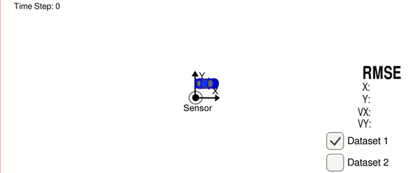
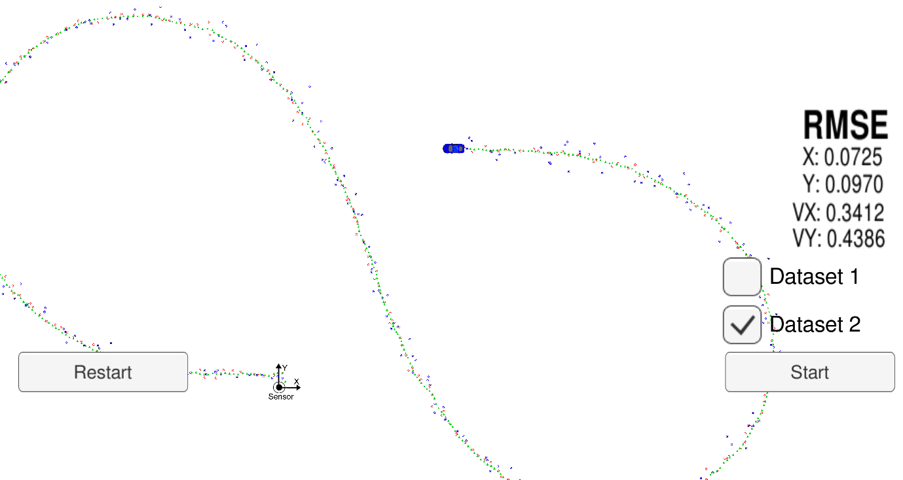

# Extended Kalman Filter Project Starter Code
Self-Driving Car Engineer Nanodegree Program

In this project you will utilize a kalman filter to estimate the state of a moving object of interest with noisy lidar and radar measurements. Passing the project requires obtaining RMSE values that are lower than the tolerance outlined in the project rubric. 

This project involves the Term 2 Simulator which can be downloaded [here](https://github.com/udacity/self-driving-car-sim/releases).

This repository includes two files that can be used to set up and install [uWebSocketIO](https://github.com/uWebSockets/uWebSockets) for either Linux or Mac systems. For windows you can use either Docker, VMware, or even [Windows 10 Bash on Ubuntu](https://www.howtogeek.com/249966/how-to-install-and-use-the-linux-bash-shell-on-windows-10/) to install uWebSocketIO. Please see the uWebSocketIO Starter Guide page in the classroom within the EKF Project lesson for the required version and installation scripts.

Once the install for uWebSocketIO is complete, the main program can be built and run by doing the following from the project top directory.

1. mkdir build
2. cd build
3. cmake ..
4. make
5. ./ExtendedKF

Tips for setting up your environment can be found in the classroom lesson for this project.

Note that the programs that need to be written to accomplish the project are src/FusionEKF.cpp, src/FusionEKF.h, kalman_filter.cpp, kalman_filter.h, tools.cpp, and tools.h

The program main.cpp has already been filled out, but feel free to modify it.

Here is the main protocol that main.cpp uses for uWebSocketIO in communicating with the simulator.


**INPUT**: values provided by the simulator to the c++ program

["sensor_measurement"] => the measurement that the simulator observed (either lidar or radar)


**OUTPUT**: values provided by the c++ program to the simulator

["estimate_x"] <= kalman filter estimated position x

["estimate_y"] <= kalman filter estimated position y

["rmse_x"]

["rmse_y"]

["rmse_vx"]

["rmse_vy"]

---

## Other Important Dependencies

* cmake >= 3.5
  * All OSes: [click here for installation instructions](https://cmake.org/install/)
* make >= 4.1 (Linux, Mac), 3.81 (Windows)
  * Linux: make is installed by default on most Linux distros
  * Mac: [install Xcode command line tools to get make](https://developer.apple.com/xcode/features/)
  * Windows: [Click here for installation instructions](http://gnuwin32.sourceforge.net/packages/make.htm)
* gcc/g++ >= 5.4
  * Linux: gcc / g++ is installed by default on most Linux distros
  * Mac: same deal as make - [install Xcode command line tools](https://developer.apple.com/xcode/features/)
  * Windows: recommend using [MinGW](http://www.mingw.org/)

## Basic Build Instructions

1. Clone this repo.
2. Make a build directory: `mkdir build && cd build`
3. Compile: `cmake .. && make` 
   * On windows, you may need to run: `cmake .. -G "Unix Makefiles" && make`
4. Run it: `./ExtendedKF `

## Editor Settings

We've purposefully kept editor configuration files out of this repo in order to
keep it as simple and environment agnostic as possible. However, we recommend
using the following settings:

* indent using spaces
* set tab width to 2 spaces (keeps the matrices in source code aligned)

## Code Style

Please (do your best to) stick to [Google's C++ style guide](https://google.github.io/styleguide/cppguide.html).

## Generating Additional Data

This is optional!

If you'd like to generate your own radar and lidar data, see the
[utilities repo](https://github.com/udacity/CarND-Mercedes-SF-Utilities) for
Matlab scripts that can generate additional data.

## Project Instructions and Rubric

Note: regardless of the changes you make, your project must be buildable using
cmake and make!

More information is only accessible by people who are already enrolled in Term 2 (three-term version) or Term 1 (two-term version)
of CarND. If you are enrolled, see the Project Resources page in the classroom
for instructions and the project rubric.

## Hints and Tips!

* You don't have to follow this directory structure, but if you do, your work
  will span all of the .cpp files here. Keep an eye out for TODOs.
* Students have reported rapid expansion of log files when using the term 2 simulator.  This appears to be associated with not being connected to uWebSockets.  If this does occur,  please make sure you are conneted to uWebSockets. The following workaround may also be effective at preventing large log files.

    + create an empty log file
    + remove write permissions so that the simulator can't write to log
 * Please note that the ```Eigen``` library does not initialize ```VectorXd``` or ```MatrixXd``` objects with zeros upon creation.

## Call for IDE Profiles Pull Requests

Help your fellow students!

We decided to create Makefiles with cmake to keep this project as platform
agnostic as possible. Similarly, we omitted IDE profiles in order to ensure
that students don't feel pressured to use one IDE or another.

However! We'd love to help people get up and running with their IDEs of choice.
If you've created a profile for an IDE that you think other students would
appreciate, we'd love to have you add the requisite profile files and
instructions to ide_profiles/. For example if you wanted to add a VS Code
profile, you'd add:

* /ide_profiles/vscode/.vscode
* /ide_profiles/vscode/README.md

The README should explain what the profile does, how to take advantage of it,
and how to install it.

Regardless of the IDE used, every submitted project must
still be compilable with cmake and make.

# Writeup for submission

<p align="center">
  
</p>

---

## EKF Workflow
1. Initialize states with first mearsurement
2. Predict state
3. Update state with received measurement
4. Loop over step 2 and step 3

---

### Initialize state
in _FusionEKF.cpp_, implement `InitializeStates()` to initialize state with first measurement
```
void FusionEKF::InitializeStates(const MeasurementPackage &measurement_pack)
{
  if (measurement_pack.sensor_type_ == MeasurementPackage::RADAR)
  {
    // TODO: Convert radar from polar to cartesian coordinates
    // and initialize state.
    double rho = measurement_pack.raw_measurements_(0);
    double phi = measurement_pack.raw_measurements_(1);
    double rho_d = measurement_pack.raw_measurements_(2);

    double pos_x = rho * std::sin(phi);
    double pos_y = rho * std::cos(phi);
    double vel_x = rho_d * std::sin(phi);
    double vel_y = rho_d * std::cos(phi);

    ekf_.x_ << pos_x, pos_y, vel_x, vel_y;

    ekf_.P_ << 10, 0, 0, 0,
        0, 10, 0, 0,
        0, 0, 10, 0,
        0, 0, 0, 10;
  }
  else if (measurement_pack.sensor_type_ == MeasurementPackage::LASER)
  {
    // TODO: Initialize state.
    double pos_x = measurement_pack.raw_measurements_(0);
    double pos_y = measurement_pack.raw_measurements_(1);

    ekf_.x_ << pos_x, pos_y, 0.0, 0.0;

    // Initialize state covariance
    ekf_.P_ << 10, 0, 0, 0,
        0, 10, 0, 0,
        0, 0, 1, 0,
        0, 0, 0, 1;
  }

  is_initialized_ = true;
  previous_timestamp_ = measurement_pack.timestamp_;
}
```

---

### Predict state
in _kalman_filter.cpp_, implement `Predict()`,  `UpdateProcessCovarianMatrix()` and `UpdateTransitionMatrix()` to predict state

```
void KalmanFilter::UpdateProcessCovarianMatrix(const double &dt)
{
  double dt2 = dt * dt;
  double dt3 = dt2 * dt;
  double dt4 = dt3 * dt;

  Q_ << dt4 / 4 * noise_ax_, 0, dt3 / 2 * noise_ax_, 0,
      0, dt4 / 4 * noise_ay_, 0, dt3 / 2 * noise_ay_,
      dt3 / 2 * noise_ax_, 0, dt2 * noise_ax_, 0,
      0, dt3 / 2 * noise_ay_, 0, dt2 * noise_ay_;
}
```
```
void KalmanFilter::UpdateTransitionMatrix(const double &dt)
{
  F_(0, 2) = dt;
  F_(1, 3) = dt;
}
```
```
void KalmanFilter::Predict(const double &dt)
{
  /**
   * TODO: predict the state
   */
  UpdateTransitionMatrix(dt);
  UpdateProcessCovarianMatrix(dt);

  x_ = F_ * x_;                       // Predict state
  P_ = F_ * P_ * F_.transpose() + Q_; // Predict covariance
}
```

---

### Update state
in _kalman_filter.cpp_, implement `Update()` for **Lidar** measurement, `UpdateEKF()` for **Radar** measurement to update state
```
void KalmanFilter::Update(const VectorXd &z)
{
  /**
   * TODO: update the state by using Kalman Filter equations
   */
  VectorXd z_pred = H_ * x_;
  VectorXd y = z - z_pred;
  MatrixXd S = H_ * P_ * H_.transpose() + R_lidar_;
  MatrixXd S_inv = S.inverse();
  MatrixXd K = P_ * H_.transpose() * S_inv; // Kalman gain

  x_ = x_ + (K * y); // Update state
  long x_size = x_.size();
  MatrixXd I = MatrixXd::Identity(x_size, x_size);
  P_ = (I - K * H_) * P_; // Update covariance matrix
}
```
```
void KalmanFilter::UpdateEKF(const VectorXd &z)
{
  /**
   * TODO: update the state by using Extended Kalman Filter equations
   */
  double epslon = 0.00001;
  double rho = sqrt(x_(0) * x_(0) + x_(1) * x_(1));
  double phi = atan2(x_(1), x_(0));
  double rho_dot;
  if (fabs(rho) < epslon)
  {
    rho_dot = 0.0;
  }
  else
  {
    rho_dot = (x_(0) * x_(2) + x_(1) * x_(3)) / rho;
  }

  VectorXd z_pred(3);
  z_pred << rho, phi, rho_dot;
  VectorXd y = z - z_pred;

  // Normalize phi
  while (y(1) > M_PI)
  {
    y(1) -= 2.0 * M_PI;
  }
  while (y(1) < -M_PI)
  {
    y(1) += 2.0 * M_PI;
  }

  MatrixXd S = Hj_ * P_ * Hj_.transpose() + R_radar_;
  MatrixXd S_inv = S.inverse();
  MatrixXd K = P_ * Hj_.transpose() * S_inv; // Kalman gain

  x_ = x_ + (K * y); // Update state
  long x_size = x_.size();
  MatrixXd I = MatrixXd::Identity(x_size, x_size);
  P_ = (I - K * Hj_) * P_; // Update covariance matrix
}
```

Additionally for Radar update, a **Jacobian matrix** update is needed.

in _tools.cpp_, implement `CalculateJacobian()` is implemented for it.
```
MatrixXd Tools::CalculateJacobian(const VectorXd &x_state)
{
   // /**
   // * TODO:
   // * Calculate a Jacobian here.
   // */

   MatrixXd Hj(3, 4);
   Hj.fill(0.0);
   float epslon = 0.00001;

   // recover state parameters
   float px = x_state(0);
   float py = x_state(1);
   float vx = x_state(2);
   float vy = x_state(3);

   // pre-compute a set of terms to avoid repeated calculation
   float c1 = px * px + py * py;
   float c2 = sqrt(c1);
   float c3 = (c1 * c2);

   // check division by zero
   if (fabs(c1) < epslon)
   {
      return Hj;
   }

   // compute the Jacobian matrix
   Hj << (px / c2), (py / c2), 0, 0,
       -(py / c1), (px / c1), 0, 0,
       py * (vx * py - vy * px) / c3, px * (px * vy - py * vx) / c3, px / c2, py / c2;

   return Hj;
}
```

---

### Evaluation performance
To evaluate the performance of EKF, **Root Mean Squared Error** is chosen as the metric.

in _tools.cpp_, implement `CalculateRMSE()` is implemented to calculate RMSE
```
VectorXd Tools::CalculateRMSE(const vector<VectorXd> &estimations,
                              const vector<VectorXd> &ground_truth)
{
   /**
   * TODO: Calculate the RMSE here.
   */
   VectorXd RMSE(4);
   RMSE.fill(0.0);
   size_t n = ground_truth.size();
   for (size_t i = 0; i < n; ++i)
   {
      // squared errors
      VectorXd error = estimations[i] - ground_truth[i];
      error = error.array() * error.array();
      RMSE += error;
   }
   RMSE /= n;
   RMSE = RMSE.array().sqrt();

   return RMSE;
}
```

---

### Result
The RMSE result as follows:
* x : 0.07
* y : 0.09
* vx : 0.34
* vy : 0.44

<p align="center">
  
</p>


